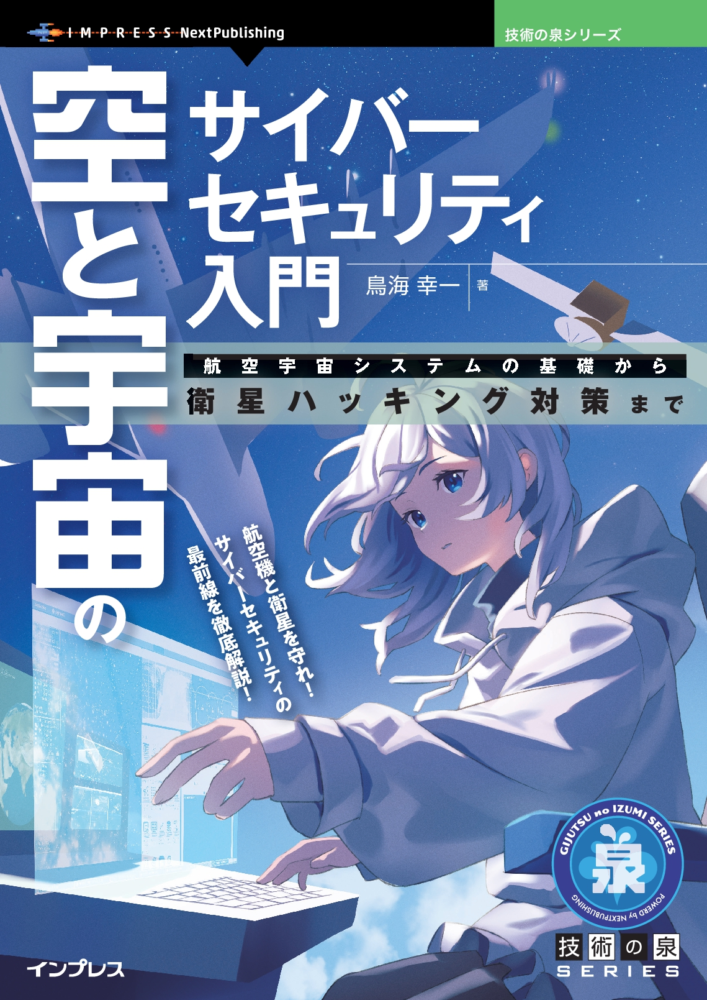
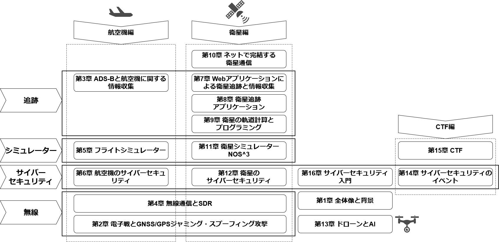
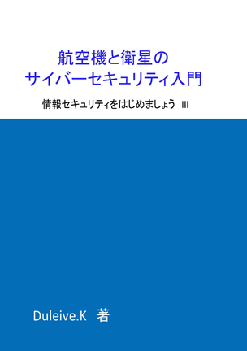
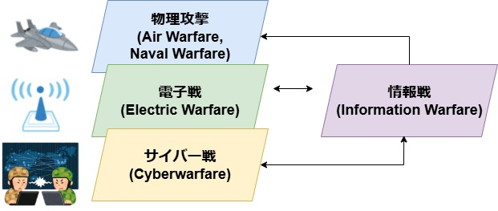
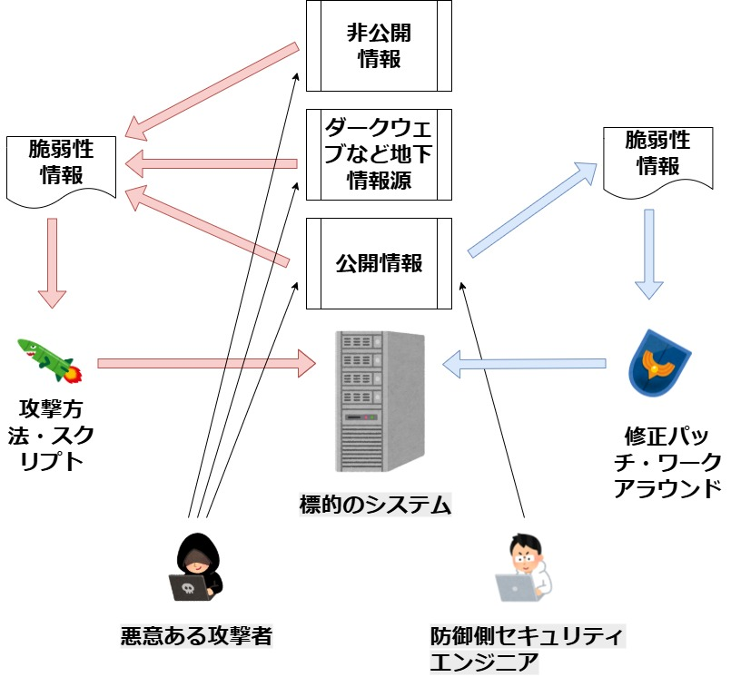

# 「空と宇宙のサイバーセキュリティー入門」 サポートページ

  

本リポジトリはインプレス社発行書籍『[空と宇宙のサイバーセキュリティー入門　航空宇宙システムの基礎から衛星ハッキング対策まで](https://nextpublishing.jp/book/18811.html)』のサポートページです。

## 販売ページ
印刷書籍版：

- Amazon販売ページ 『[空と宇宙のサイバーセキュリティ入門　航空宇宙システムの基礎から衛星ハッキング対策まで (技術の泉シリーズ) オンデマンド (ペーパーバック) –](https://amzn.asia/d/eWkbayj)』

電子書籍版：

- Amazon販売ページ 『[空と宇宙のサイバーセキュリティ入門　航空宇宙システムの基礎から衛星ハッキング対策まで (技術の泉シリーズ) Kindle Edition–](https://www.amazon.co.jp/gp/product/B0FM28RHNF/)』

- Rakuten ブックス販売ページ 『[空と宇宙のサイバーセキュリティ入門　航空宇宙システムの基礎から衛星ハッキング対策まで　[電子書籍版]](https://books.rakuten.co.jp/rk/19a5071792fe3ab0a25b3bddef84a8c5/)』

- 紀伊国屋書店販売ページ 『[空と宇宙のサイバーセキュリティ入門 - 航空宇宙システムの基礎から衛星ハッキング対策まで](https://www.kinokuniya.co.jp/f/dsg-08-EK-2208111)』

- Google Play販売ページ 『[空と宇宙のサイバーセキュリティ入門: 航空宇宙システムの基礎から衛星ハッキング対策まで](https://play.google.com/store/books/details/%E9%B3%A5%E6%B5%B7_%E5%B9%B8%E4%B8%80_%E7%A9%BA%E3%81%A8%E5%AE%87%E5%AE%99%E3%81%AE%E3%82%B5%E3%82%A4%E3%83%90%E3%83%BC%E3%82%BB%E3%82%AD%E3%83%A5%E3%83%AA%E3%83%86%E3%82%A3%E5%85%A5%E9%96%80?id=Qgx5EQAAQBAJ)』

- 電子書籍ストア honto販売ページ 『[空と宇宙のサイバーセキュリティ入門](https://honto.jp/ebook/pd_34561235.html)』

- Reader Store販売ページ 『[空と宇宙のサイバーセキュリティ入門　航空宇宙システムの基礎から衛星ハッキング対策まで](https://ebookstore.sony.jp/title/11240945/)』

- 電子書籍ストア　ブックライブ販売ページ 『[空と宇宙のサイバーセキュリティ入門　航空宇宙システムの基礎から衛星ハッキング対策まで](https://booklive.jp/product/index/title_id/1972059/vol_no/001)』

- 電子書籍ストア ブックウォーカー販売ページ 『[空と宇宙のサイバーセキュリティ入門　航空宇宙システムの基礎から衛星ハッキング対策まで](https://bookwalker.jp/def35ffa6f-5f90-41a7-9c3e-e0b868731229/)』

- BOOK TECH販売ページ 『[空と宇宙のサイバーセキュリティ入門　航空宇宙システムの基礎から衛星ハッキング対策まで](https://book-tech.com/books/73522b52-368c-42a5-ba25-afb406bb65b8)』

## はじめにより抜粋

本書は初心者向けの解説本です。航空機と衛星のサイバーセキュリティーの対策を考えるためには、航空機や衛星のシステムを理解する必要があります。本書では、まずそれらのシステムの基礎を解説しています。また、航空機や衛星に関連するWebサイトやソフトウェアの取り扱い方法と、公開情報からどのような情報が入手できるのかも解説します。その後に、航空機と衛星のサイバーセキュリティーについて解説していきます。

読者の方がこの本を読み終えた後、航空機と衛星に関するサイバーセキュリティーについて、どのような点に気をつければいいのかが理解できるように執筆しています。

本書では、民間の、そして、誰でもインターネット上でアクセスできる公開情報のみを扱います。一般に公開されていない軍事情報や機密情報は扱いません。

本書の後半では、ドローン、AI、航空機や衛星のサイバーセキュリティー関連のイベント、Capture The Flag(CTF: サイバーセキュリティー技術を競うコンテスト)についても解説しています。CTFの章は、航空機や衛星のCTFに参加を目指している方のための手引書になることを目指して執筆しています。

本書は入門書ですので、航空機、衛星、サイバーセキュリティーのいずれか、あるいは全てについて初心者の方を読者対象にしています。本書を読む上であらかじめ必要となる知識は特にありませんが、ハンズオン(実習)部分ではオープンソースのソフトウェアをインストールしたり設定したりしますので、パソコンの基本操作ができることを前提としています。

## 目次

- 第1章　全体像と背景
- 第2章　電子戦とGNSS/GPSジャミング・スプーフィング攻撃
- 第3章　航空機編I ADS-Bと航空機に関する情報収集
- 第4章　航空機編II/衛星編V 無線通信とSDR
- 第5章　航空機編III フライトシミュレーター
- 第6章　航空機編IV 航空機のサイバーセキュリティ
- 第7章　衛星編I Webアプリケーションによる衛星追跡と情報収集
- 第8章　衛星編II 衛星追跡アプリケーション
- 第9章　衛星編III 衛星の軌道計算とプログラミング
- 第10章　衛星編IV ネットで完結する衛星通信
- 第11章　衛星編VI 衛星シミュレーターNOS^3
- 第12章　衛星編VII 衛星のサイバーセキュリティ
- 第13章　ドローンとAI
- 第14章　CTF編I サイバーセキュリティのイベント
- 第15章　CTF編II CTF
- 第16章　サイバーセキュリティ入門
- 付録A　自動車と船舶のサイバーセキュリティー
- 付録B　飛行機、ヘリコプター、衛星、ドローンの役割
- 付録C　パイロットの免許

  

## 執筆後の情報

#### 宇宙サイバーセキュリティ講座開催
2026年3月20日夜７時より、オンラインで[宇宙サイバーセキュリティ講座　第０回：CYSATの報告と今後の講座の予告](https://aerospace.connpass.com/event/385431/)を開催しました。その中で紹介したリファレンスは、[宇宙サイバーセキュリティ講座　リンク集](LINKS2.md)にて公開しています。
また、4月3日より、連続5回の宇宙サイバーセキュリティ講座を開催中です。詳しくは、[connpassのグループページ][(https://aerospace.connpass.com/)をご覧ください。

#### 日本初の航空宇宙CTF開催
2025年11月23日に渋谷にて開催される[A.V.Tokyo 2025](https://www.avtokyo.org/avtokyo2025)にて、日本初の航空宇宙CTFである、[The Aerospace CTF  in Japan  / 航空宇宙CTF](https://www.avtokyo.org/avtokyo2025/events#h.dqpeqoc6vwme)が開催されました。

#### NOAAシリーズが運用終了
第４章(p120)及び第１０章(p293)において、NOAA（衛星）シリーズの運用状態[POES Performance Status](https://www.ospo.noaa.gov/operations/poes/status.html)はNOAA-15,18,19全てグリーンでした。しかし、NOAA-18が故障により運用が終了し、残るNOAA-15,19も2025年8月18日に運用が終了しました。運用終了した衛星はCelesTrakの、ACTIVEのTLEリストからは外され、代わりにNOAA-20がACTIVEリストに入りました。それに伴い、サンプルに使っていた衛星をNOAA 15から、NOAA 20に変え、また、経過時間が長いのですべてのTLEを最新（2026年4月）に更新し、サポートページにおけるソースコードを更新しました。新しいソースコードは以下からダウンロードしてください。
[第9章のソースコード (修正・データの更新済)](https://github.com/Duleive/Aerospace_CyberSec/blob/main/sourcecode.md)

#### DEFCON33
今年(2025)のDEFCONが開催されました。Hack-A-Satは開催されなかった様です。その代わり、衛星に関するCTFが二つ開催され、一部はオンラインからの参加も可能でした。

#### 衛星に対する攻撃の脅威
内閣府ホームページ　[【参考1】人工衛星を無力化する手法と軌道上サービス技術](https://www8.cao.go.jp/space/taskforce/debris/dai5/siryou4_2.pdf)

#### 史上初の宇宙ファイアーウォール衛星
中国が史上初の「宇宙空間にあるインターネットファイアーウォール衛星」を含む衛星を打ち上げました。[China Launches First-Generation 'Satellite Internet Firewall' Security Payload](https://uniteddaily.my/en/e763c987-6451-4bed-97dd-5bb0ac2bc801)

#### 出版記念講演会開催
10月11日夜７時より、カフェ ドレッドノート様にて出版記念講演会を開催します。
[ZOOMライブ配信視聴　「空と宇宙のサイバーセキュリティ入門」鳥海幸一氏　講演会](https://dreadnought20251011z.peatix.com/view)

## 本文中のリンク
本書は編集の都合上、いくつかのリンクが電子版において無効になっています。また、リンク切れになっているものもあります。それらについては[本文中のリンク](LINKS.md)にて有効なリンクを公開しています。

## 第9章のプログラミングのソースコード
本書第9章　衛星編III 衛星の軌道計算とプログラミングにおいて、Pythonのソースコードが掲載されています。
[第9章のソースコード (修正・データの更新済)](https://github.com/Duleive/Aerospace_CyberSec/blob/main/sourcecode.md)

## 底本

本書は、技術系同人誌即売会『[技術書典 15](https://techbookfest.org/event/tbf15)』において頒布した同人誌である、
『[航空機と衛星のサイバーセキュリティ入門 ～情報セキュリティをはじめましょう III～」](https://techbookfest.org/product/4e9nvWyhWYDaCx7kR9fpff)』を底本としています。

  

商業版出版にあたり、大幅に加筆して再構成しました。同じテーマの本ですので、本書を商業誌版、底本を同人誌版、とします。商業誌版は同人誌版の内容を全て含んでおりますので、商業誌版を購入された方は、同人誌版を新たに買う必要はございません。

# 正誤表
(作成中)

## Wikipediaのリンク

本書においてはWikipediaは出典としては使っていませんが、参考のため、該当するページを記載します。
(作成中)

## 追加のダイアグラム
第２章　電子戦とサイバー戦の概念について

  

第１６章　公開情報・非公開情報と脆弱性

  

### Ver
Ver 0.9b (2026/03/20)
©Koichi Toriumi 2016 All rights reserved.
